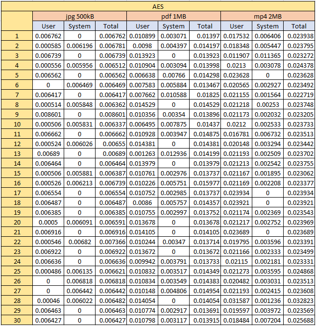

| NRP        | Name                          |
|------------|-------------------------------|
| 5025211008 | Muhammad Razan Athallah       |
| 5025211014 | Alexander Weynard Samsico     |
| 5025211139 | Apta Rasendriya Wijaya        |
| 5025211158 | Ghifari Maaliki Syafa Syuhada |

# Report
To showcase the difference between 3 distinct encryption method, namely Advanced Encryption Standard (AES), Data Encryption Standard (DES), and RC4, we made a simple CRUD web app using Laravel with the following features:
1. Authenticating user with password
2. Giving file access to authorized user
3. Encrypting files and storing it in the database
4. Decrypting stored files before downloading

Here is a preview of our website:
#### Homepage  

#### Register page  

#### Login page  

#### Edit files and username  

#### Download files  

## Benchmark
The methodology employed for benchmarking the three encryption methods involves a comparative analysis of their decryption times across three distinct file sizes: 500KB, 1MB, and 2MB. The constraint of adhering to the size limitations imposed by HTTP POST requests necessitates the use of smaller file sizes. To measure decryption performance, the evaluation leverages the user runtime and system runtime metrics obtained through the utilization of the rusage() function in PHP. This process entails conducting 30 iterations for each combination, thereby accumulating a total of 270 trials. The resulting outcomes are summarized as follows:

### AES

| File size | Average time |
|-----------|--------------|
| 500 kB    | 0.006678     |
| 1 MB      | 0.014271     |
| 2 MB      | 0.024004     |

### DES

| File size | Average time |
|-----------|--------------|
| 500 kB    | 0.01681      |
| 1 MB      | 0.065642     |
| 2 MB      | 0.111473     |

### RC4

| File size | Average time |
|-----------|--------------|
| 500 kB    | 0.102148     |
| 1 MB      | 0.21458      |
| 2 MB      | 0.301408     |

## Result
In terms of processing speed, the test results indicate that AES outperformed the other two encryption methods, which is noteworthy considering AES is renowned for its robust security features. This counterintuitive outcome underscores the efficiency of AES encryption. Following AES, DES emerged as the second fastest, with RC4 ranking third in terms of speed. 
